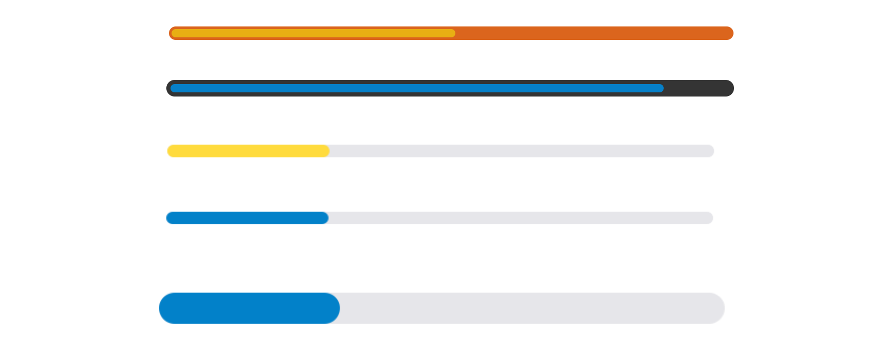

# LinearProgressBar

Simple progress bar for iOS




[](http://cocoapods.org/pods/LinearProgressBar)
[](http://cocoapods.org/pods/LinearProgressBar)
[](http://cocoapods.org/pods/LinearProgressBar)
[](https://travis-ci.org/gordoneliel/LinearProgressBar)

## Usage

To run the example project, clone the repo, and hit run.

## About

LinearProgressBar is a simple progress indicator control for iOS.

## Installation

LinearProgressBar is available through [CocoaPods](http://cocoapods.org). To install
it, simply add the following line to your Podfile:

```ruby
pod "LinearProgressBar"
```

## Author

Eliel Gordon, gordoneliel@gmail.com

## License

LinearProgressBar is available under the MIT license. See the LICENSE file for more info.

## New in This Fork
Adjust bar color based on progressValue by providing a closure to it. If the closure is not set, it will use the color set in the storyboard/IB.

```swift
linearProgressView.barColorForValue = { value in
	switch value {
	case 0..<20:
		return UIColor.redColor()
	case 20..<60:
		return UIColor.orangeColor()
	case 60..<80:
		return UIColor.yellowColor()
	default:
	return UIColor.greenColor()
	}
}

```

